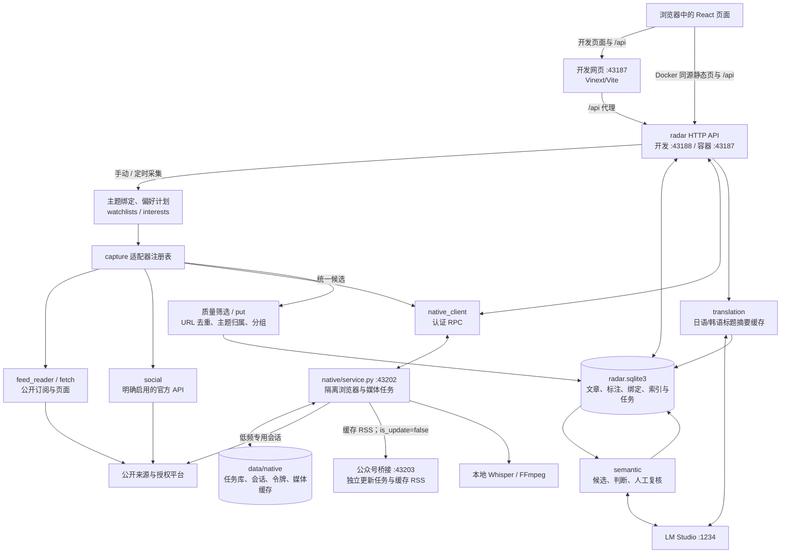

# 架构与数据流

本文依据当前仓库源码说明职责与边界。此次运行结果见 [变更记录](changes/)；旧环境的平台实测见 [历史索引](history/README.md)，不能据此认定新 checkout 或账号已接通。

## 运行形态

`ai-finance-collector/` 提供 Python 采集、SQLite 与 HTTP；`ai-finance-radar/` 提供 React 页面。目录名沿用既有工程，产品入口为信息雷达。

| 形态 | 网页与 API | 依赖 |
| --- | --- | --- |
| 双终端开发 | Vinext/Vite 在 `127.0.0.1:43187` 提供页面，将 `/api` 代理到 Python 的 `127.0.0.1:43188` | Node、npm、Python |
| Docker | `build:container` 产物由 Python 同时提供静态页面与 API，容器端口 43187 映射到宿主机 loopback | 构建需要 Node；运行镜像为 Python |
| 可选原生执行器 | FastAPI 在 `127.0.0.1:43202` 提供认证浏览器/媒体 RPC | Apple Silicon、独立 Python 3.12、Chromium、MLX Whisper |
| 可选公众号桥接 | 独立 Compose 在 `127.0.0.1:43203` 提供管理界面和缓存 RSS | Docker、本人扫码授权 |
| 可选模型服务 | LM Studio 默认 1234，提供翻译、向量和资料关系判断 | 对应本地模型 |

普通 `npm run build` 使用 Vinext/Cloudflare 构建链；`npm run build:container` 使用 React/Vite 生成 `container-dist/`，通过 `container-main.tsx` 挂载相同页面。两种产物分别验证。普通 Vite 配置静态导入 `.openai/hosting.json`，没有云端绑定时也要保留。

## 数据流

箭头表示服务调用和处理方向，来源响应经适配器返回统一候选后归档；原生正文/任务响应由后端同步回主库。手动/待接入策略不会因图中的统一管线变成自动采集。公众号上游更新由桥接任务控制，主采集器只读缓存。音视频下载与转写需要用户明确提交任务。

## 模块职责

| 模块 | 职责与协作 |
| --- | --- |
| `radar.py` | 兼容 CLI/公共调用、HTTP、安全入口与调度；运行时注入当前 DB/ROOT/fetch 等依赖，保留测试补丁点 |
| `database.py`、`archive_store.py` | 连接/WAL、schema 与迁移，以及统一归档/备份；radar 封装传入当前连接与路径，避免缓存可替换全局值 |
| `collection_runner.py` | 采集锁、来源计划、四线程网络读取、归档事务、结果、翻译排队与备份的编排 |
| `capture.py`、`feed_reader.py` | 适配器契约、策略说明、条件请求；有效订阅解析后才更新缓存，304 复用缓存 |
| `social.py` | 官方 API 设置、授权开关、额度、令牌和冷却；统一选择 effective adapter |
| `interests.py` | URL 校验、发现与登记、持久偏好、到期计划 |
| `watchlists.py`、`engineering.py`、`reddit_quality.py` | 主题绑定与文章归属、开发者内容筛选、Reddit 主帖质量和历史可见性 |
| `source_lifecycle.py`、`source_details.py` | 软删除/解绑，以及来源实际步骤、能力、调度和统计说明 |
| `content_store.py`、`readable.py`、`text_utils.py` | 共享正文、媒体、任务结果、订阅扩展字段、文本处理与保留规则 |
| `dedup.py` | 保守同文分组、代表版本及筛选后分页；保留各版本原文与标注 |
| `semantic.py`、`semantic_api.py` | 持久关系/任务、复核、分组、拆分、撤销、资格与 HTTP 入口；保留公共 worker 调用兼容性 |
| `semantic_worker.py`、`semantic_models.py` | 文件锁与线程、退避/任务处理、向量召回、模型 RPC、引用/数字/冲突防护；当前领域依赖显式传入 |
| `translation.py`、`translation_model.py` | 前者持有队列、缓存、重启恢复和失败冷却；后者负责本地模型请求、分段、数字占位和完整性保护 |
| `source_api.py`、`article_api.py`、`api_contracts.py` | 来源/主题与资料领域路由；dataclass 服务契约显式注入需要的函数，不传整个 radar 模块 |
| `collection_api.py`、`native_client.py` | 平台、播客、正文和媒体网页入口，以及后端到原生服务的认证 RPC |
| `native/service.py`、`state.py` | 兼容路由、认证/Origin 与 lifespan；显式初始化私有目录/token 和 WAL 数据库 |
| `native/wechat_bridge.py`、`media_api.py` | 受限 loopback 缓存读取与无重定向策略；流式大小限制、临时清理和任务提交 |
| `native/browser_worker.py`、`manual_login.py` | 平台/域名隔离会话、本人登录窗口、预算、暂停和冷却 |
| `native/jobs.py`、`transcribe.py`、`model_config.py` | 独立任务库、恢复/取消、媒体准备、分段解码、离线 Whisper 与模型目录检查 |
| 前端 `lib/api.ts`、`lib/api-types/` | 共用传输和按领域组织的 DTO；保留不同入口的原有错误契约 |
| 前端 `app/` | 兼容页面入口与既有导出；`app/page.tsx` 指向 workspace |
| 前端 `features/workspace`、`feed`、`articles`、`topics` | 工作台编排与状态、信息流轮询/列表、详情/录入、主题视图 |
| 前端 `features/sources` | 来源状态协调、详情请求、列表/详情视图、新增表单、删除对话框与连接 |
| 前端 `features/platform`、`media`、`semantic` | 平台连接/发现/导入、媒体任务/字幕、资料关系/草稿/复核的协调 hooks 与视图 |
| 前端 `lib/url-state.ts` | 视图、主题、筛选、分页及详情的 URL 状态与前进/后退恢复 |

## 数据与一致性

SQLite 使用 WAL，主连接设置 `secure_delete`。文章身份由标准化 URL 生成；`articles` 保存原文与个人标注，`sightings` 保存多个入口。主题通过绑定和归属表复用文章，不复制正文或媒体任务。

URL 去重、新闻索引同文分组、语义关系是不同层次。分组改变展示，查询先筛选再分组分页；各版本笔记、收藏和核验状态独立保存。正文或模型配置变化会使相应语义结果失效并重新排队；自动折叠默认关闭，需要独立标注评估达标。

采集使用进程内锁和文件锁，网络读取最多四线程并行，归档使用 SQLite 事务。普通调度每六小时检查；原生调度每分钟检查到期状态，实际访问仍遵守每源间隔、账号串行和预算。语义工作进程持有独立文件锁，模型请求在数据库写事务外执行。

初始化负责增量 schema、迁移前快照、种子来源配置与索引；页面新增来源保存于数据库。所有 `radar.py` CLI 都先初始化并清理历史快照中的 Reddit 提供方内容，`status` 不能当作纯只读命令。

## 信任与限制

主 HTTP 检查 Host，写请求还检查 Origin；公开 URL、DNS 与重定向校验拒绝内网来源。显式 Fake-IP 兼容只作用于域名解析结果。原生服务需要本地令牌且拒绝带 Origin 的调用，页面通过后端访问它。

账号会话、令牌、私有 API 设置、数据库、媒体和备份不属于源码。原生执行器使用项目专用 profile。普通快照按保留策略排除 Reddit 提供方内容，独立保留个人标注，不包括原生会话/任务库。

新提取的 state/bridge/media 模块导入不创建私有目录；`native/service.py` 导入仍会初始化，因此测试必须先设置隔离环境。主 HTTP 按 semantic → collection → source/article 委派，保留核心安全与未委派入口。

当前没有完整远程多用户认证或云端任务平台。入口成功不代表全文、全历史或事实核验；迁移源码不代表迁移/验证了账号。具体耦合与缺口见 [审计](audit.md)。
